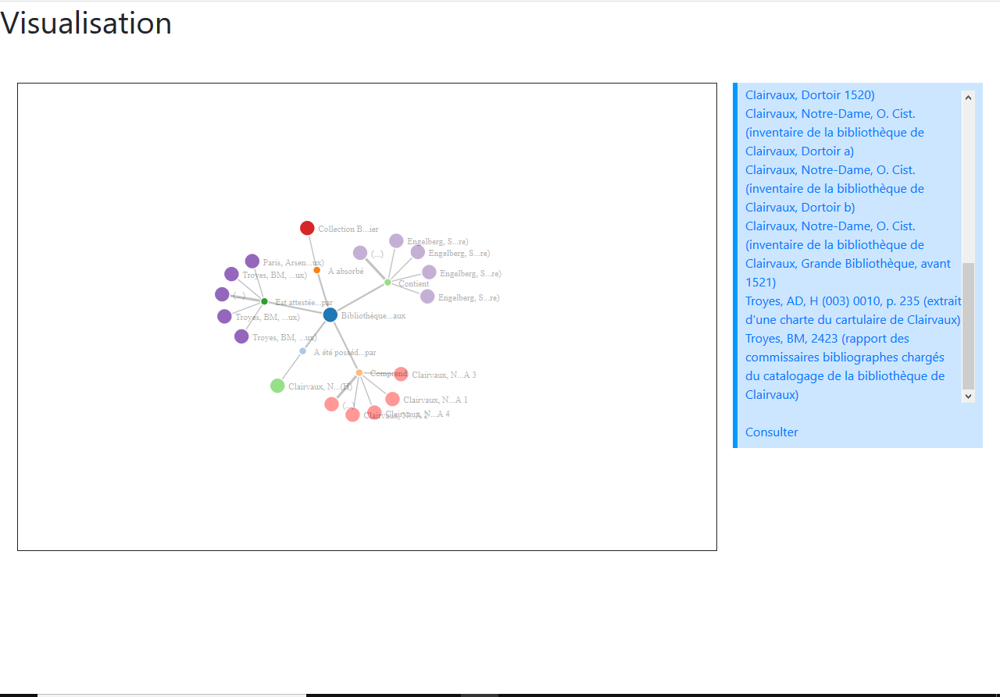
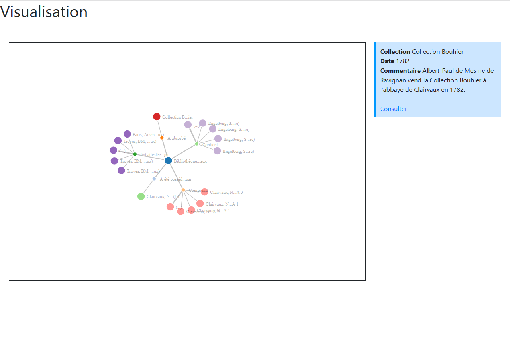

# Data visualization tool

## How to use

The simulation scripts (under assets/js/simulate.js) requires d3.json and a bit of jQuery.

Batteries are already included, all you need to tweak when changing data are the data info function and the loading function :

```js
function displayInfo(d) {
	console.log(d);
	
	$("#info").css("display", "inline-block");
	
	let t = "";
	
	// root
	if (d.data.hasOwnProperty("data")) {
		for (var i=0; i < d.data.data.length; i++) {
			t += "<b>"; t += d.data.data[i].type.toTitleCase(); t += "</b> ";
			t += d.data.data[i].value;
			t += "<br>";
		}
	} else {
		if (d.data.type !== "..." && d.data.type !== "category") {
			t += "<b>"; t += `${d.data.type.toTitleCase()}`; t += "</b> ";
			t += d.data.notice;
			t += "<br>";
			
			if (d.data.hasOwnProperty("date")) {
				t += "<b>Date</b> ";
				t += d.data.date;
				t += "<br>";
			}
			
			if (d.data.hasOwnProperty("lieu")) {
				t += "<b>Lieu</b> ";
				t += d.data.lieu;
				t += "<br>";
			}
			
			if (d.data.hasOwnProperty("commentaire")) {
				t += "<b>Commentaire</b> ";
				t += d.data.commentaire;
				t += "<br>";
			}
		} else if (d.data.type === "...") {
			t += "<nav><ul class=\"moredata no-li\">";
			for (var i=0; i < d.data.moredata.length; i++) {
				t += "<li><a href=\"http://bibale.irht.cnrs.fr/"; t += d.data.moredata[i].id; t += "\" target=\"_blank\">"; t += d.data.moredata[i].notice; t += "</a></li>";
			}
			t += "</ul></nav>";
		} else if (d.data.type === "category") {
			t += "<b>"; t += d.data.notice; t += "</b>";
		}
	}
	
	if (d.data.type !== "category") {
		t += "<br>";
		t += "<a href=\"http://bibale.irht.cnrs.fr/";
			t += d.data.id.toString();
		t += "\" target=\"_blank\">Consulter</a>";
	}
	
	$("#info").html(t);
}

(async (resx_id) => {
	// const response = await fetch("https://cdn.rawgit.com/mbostock/4062045/raw/5916d145c8c048a6e3086915a6be464467391c62/miserables.json");
	const response = await fetch(`API.LINK/${resx_id}`);
	const json = await response.json();
	
	simulate({
		id: "#sketchbook"
		, data: formatData(json, resx_id)
		, text: d => {
			if (d.data.notice.length <= 15)
				return d.data.notice;
			return `${d.data.notice.substring(0, 12)}...${d.data.notice.substring(d.data.notice.length - 3, d.data.notice.length)}`;
		}
		, onclick: d => displayInfo(d)
		, onmouseover: d => 0
		, onmouseout: d => 0
		, radius: d => {
			if (d.hasOwnProperty("not_data"))
				return 5;
			return 10;
		}
	});
})(7132);  // ressource id we are loading
```

## Images



